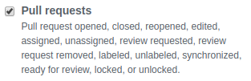

# Bomba CI


A simple server that carries out CI pipelines for your projects on GitHub.

 1. [Install](#install)
 2. [Configure](#configure)
    * [Configuring the Target Project on GitHub](#configuring-the-target-project-on-github)
    * [Configuring the Server](#configuring-the-server)
    * [Configuring the Pipeline](#configuring-the-pipeline)
 3. [Launch](#launch)

## Install
 1. [Install Node.js](https://nodejs.org/en/)
 2. Install dependencies:
    ``` sh
    npm install
    ```

## Configure
### Configuring the Target Project on GitHub
 1. Create a GitHub [webhook](https://developer.github.com/webhooks/) for the project which you want to set up CI. Make sure that you pick a webhook secret and take note of it. Also make sure that pull requests trigger the webhook:

    
 2. [Create a GitHub access token](https://help.github.com/en/articles/creating-a-personal-access-token-for-the-command-line#creating-a-token)

### Configuring the Server
Create a file called `.env` inside the project directory which looks like the following:
``` env
GITHUB_ACCESS_TOKEN=<token>
GITHUB_REPO=<repo_name>
GITHUB_USER=<user_name>
WEBHOOK_ENDPOINT_PORT=<port_number>
WEBHOOK_ENDPOINT_SUFFIX=<endpoint_suffix> # example: /webhooks/github
WEBHOOK_SECRET=<webhook_secret>
WORK_DIR=<path>
```

### Configuring the Pipeline
Create a file called `bomba.yml` inside the target project which looks like the following:
``` yml
env: '.env'
build: 
  - name: client
    command: "docker-compose build client"
  - name: server
    command: "docker-compose build server"
```

#### Environment File
If there is an environment file that's not tracked by Git, its name must be specified using the `env` keyword in the `bomba.yml` file. Also it has to be placed inside the `WORK_DIR` directory in the host machine.

#### Build Dependencies
Any dependencies for building/testing the target project has to be installed in the host machine that the server is to be deployed. For the example above, both `Docker` and `docker-compose` has to be installed alongside the server.

## Launch
``` sh
# launch in development mode
npm run dev

# start server in background
npm start

# stop server
npm stop
```