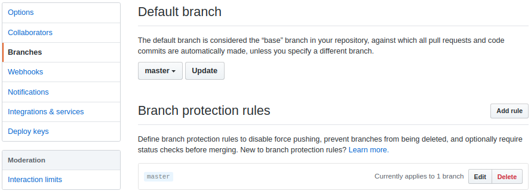

# Bomba CI


A simple server that carries out CI pipelines for your projects on GitHub.

 1. [Server Configuration](#server-configuration)
 2. [Target Repository Configuration](#target-repository-configuration)
 3. [Commands](#commands)

## Server Configuration
 1. [Install Node.js](https://nodejs.org/en/)
 2. [Create a personal access token on GitHub](https://help.github.com/en/articles/creating-a-personal-access-token-for-the-command-line#creating-a-token)
 3. Pick a secure webhook secret.
 4. Create a file called `.env` inside the project directory in the following format:
   ``` env
   GITHUB_ACCESS_TOKEN=<token>
   HOST_IP=<ip_address>
   SERVER_PORT=<port_number>
   WEBHOOK_ENDPOINT_SUFFIX=<endpoint_suffix> # example: /webhooks/github
   WEBHOOK_SECRET=<webhook_secret>
   WORK_DIR=<absolute_path> # example: /home/utku/bombaci
   ```

## Target Repository Configuration
### Webhook
Create a GitHub [webhook](https://developer.github.com/webhooks/) for the project which you want to set up CI. Make sure that pull requests trigger the webhook:


### Branch Protection
Select a protected default branch (e.g. `master`) via GitHub repository settings:



Edit rules for the protected branch so that pull requests cannot be accepted before certain status checks pass:


### Pipeline File
Create a file called `bomba.yml` which might look like the following:
``` yml
env: '.env'
build: 
  - name: client
    command: "docker-compose build client"
  - name: server
    command: "docker-compose build server"
  - name: db
    command: "docker-compose build db"
test:
  - name: server
    command: "docker-compose up -d db && docker-compose run server npm run test && docker-compose down"
```

### Environment File
If there's an environment file that's not tracked by Git but required during the CI process, its name must be specified using the `env` keyword in `bomba.yml`. Also it has to be copied beforehand into `<WORK_DIR>` in the host machine.

For instance, if `WORK_DIR` is `/home/utku/bombaci`, then the absolute path for this file has to be `/home/utku/bombaci/.utkuufuk_bomba-ci` for this repository.

### Dependencies
Any dependencies for building/testing the target project has to be installed in the host machine that `bomba-ci` is going to be deployed. 

As an example, `Docker` has to be be pre-installed in the host machine if a project is meant to be built and/or tested using `Docker` during the CI process.

## Commands
Install dependencies:
``` sh
npm install
```

Start server
``` sh
# development mode
npm run dev

# production mode (background process)
npm start
```

Check server process:
``` sh
npm run check
```

Stop server:
``` sh
npm stop
```